# Cascade 50

**Fifty Oric-1 classics, reborn.** A MonoGame remake of Cascade Games' 1983 *Cassette 50* tape for the Oric-1, for
Android, iOS, macOS and Windows.

The originals were short, text-only BASIC listings. Every game here keeps its title and idea but is rebuilt from scratch
as a proper modern-retro game: vector and pixel-art graphics with glows and particles, synthesised chiptune sound,
difficulty that ramps up, best scores, and controls for keyboard, mouse, game pad and touch.

<p align="center">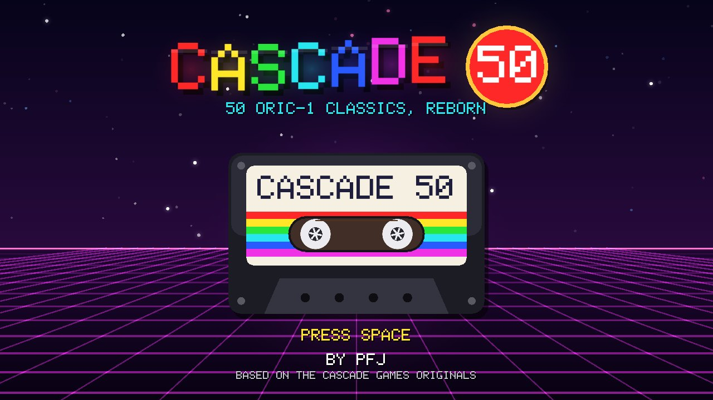</p>

By PFJ, based on the Cascade Games originals. Copyright © 2026 Paul F Johnson, released under the
[DILLIGAF License](LICENSE).

## The games

<p align="center">
  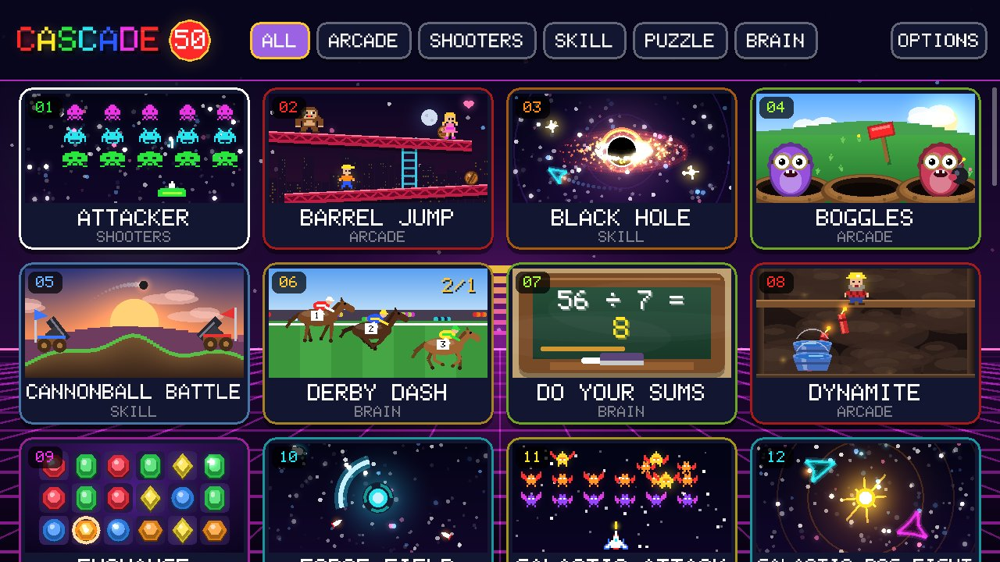
  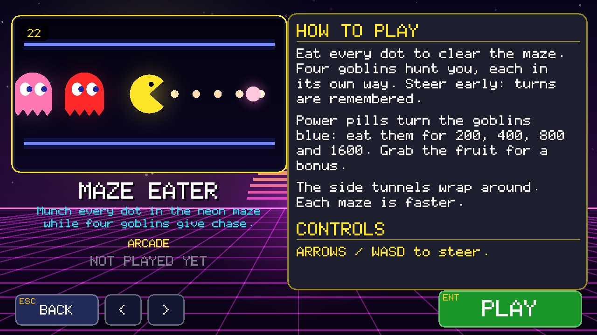
</p>

In the order of the original Oric-1 tape:

<table>
<tr>
<td align="center" valign="top" width="20%">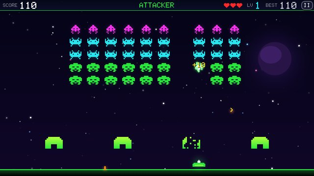<br><sub><b>01 Attacker</b><br>Hold the line against the marching alien horde.</sub></td>
<td align="center" valign="top" width="20%">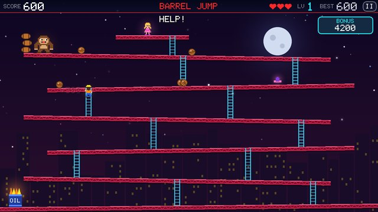<br><sub><b>02 Barrel Jump</b><br>Dodge the brute's barrels and climb the girders to the top.</sub></td>
<td align="center" valign="top" width="20%">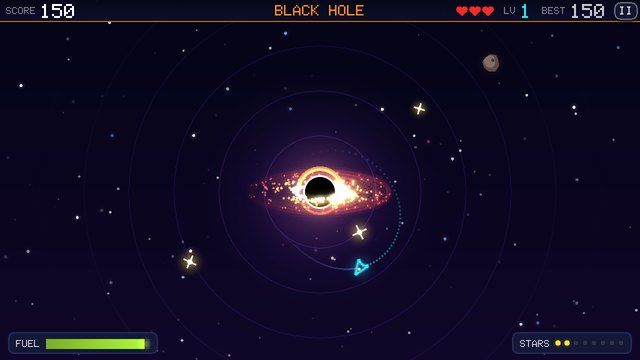<br><sub><b>03 Black Hole</b><br>Skim the event horizon to steal energy stars from a hungry black hole.</sub></td>
<td align="center" valign="top" width="20%">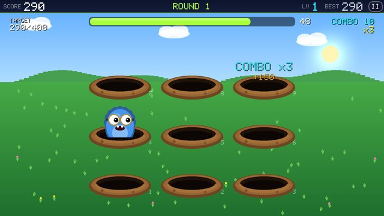<br><sub><b>04 Boggles</b><br>Bop the goggle-eyed Boggles as they pop up. Mind the bombs!</sub></td>
<td align="center" valign="top" width="20%">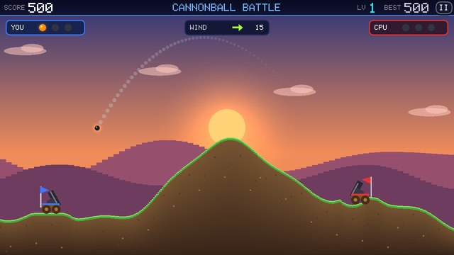<br><sub><b>05 Cannonball Battle</b><br>Out-gun the computer in an artillery duel across crumbling hills.</sub></td>
</tr>
<tr>
<td align="center" valign="top" width="20%">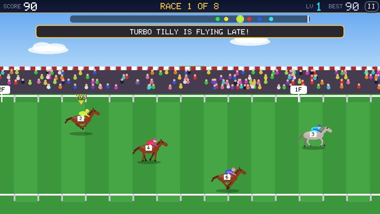<br><sub><b>06 Derby Dash</b><br>A day at the races: study the form, back a winner, beat the bookie.</sub></td>
<td align="center" valign="top" width="20%">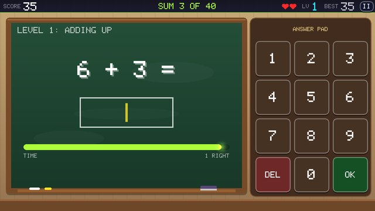<br><sub><b>07 Do Your Sums</b><br>Quick-fire mental arithmetic against the clock. No calculators!</sub></td>
<td align="center" valign="top" width="20%">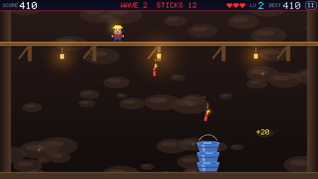<br><sub><b>08 Dynamite</b><br>Catch the mad miner's dynamite in your water buckets. Don't miss!</sub></td>
<td align="center" valign="top" width="20%">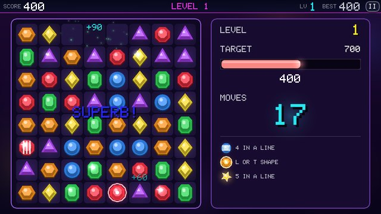<br><sub><b>09 Exchange</b><br>Swap glittering jewels into lines of three before the moves run out.</sub></td>
<td align="center" valign="top" width="20%">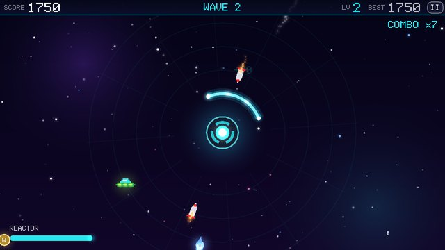<br><sub><b>10 Force Field</b><br>Swing the force field round the reactor and bat the missiles away.</sub></td>
</tr>
<tr>
<td align="center" valign="top" width="20%">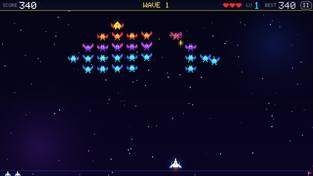<br><sub><b>11 Galactic Attack</b><br>The alien convoy swoops down in screaming dives. Hold your nerve.</sub></td>
<td align="center" valign="top" width="20%">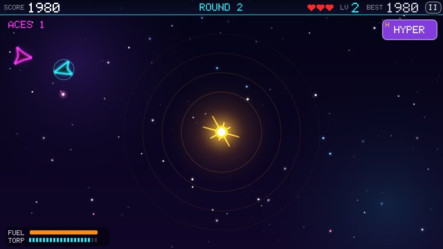<br><sub><b>12 Galactic Dog Fight</b><br>Duel enemy aces round a hungry star. Mind the gravity.</sub></td>
<td align="center" valign="top" width="20%">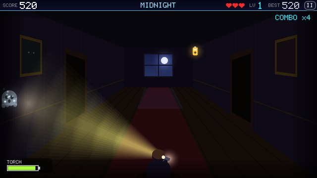<br><sub><b>13 Ghosts</b><br>Hold back the ghosts with your torch until dawn breaks.</sub></td>
<td align="center" valign="top" width="20%">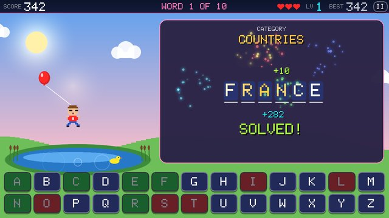<br><sub><b>14 Hangman</b><br>Guess the word before the balloons pop and he lands in the pond.</sub></td>
<td align="center" valign="top" width="20%">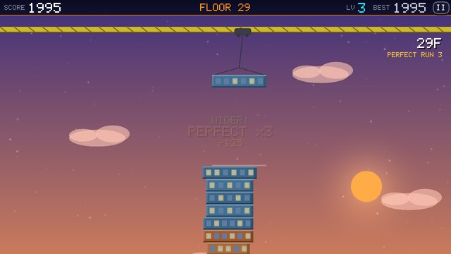<br><sub><b>15 High Rise</b><br>Stack the floors as the crane swings. Build up into space.</sub></td>
</tr>
<tr>
<td align="center" valign="top" width="20%">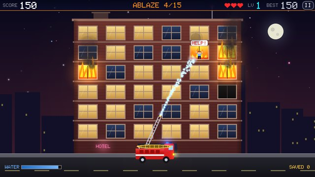<br><sub><b>16 Inferno</b><br>Douse the blazing tower block and catch the people who jump.</sub></td>
<td align="center" valign="top" width="20%">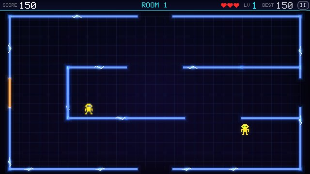<br><sub><b>17 Intruder</b><br>Shoot your way through robot-guarded rooms of electrified walls.</sub></td>
<td align="center" valign="top" width="20%">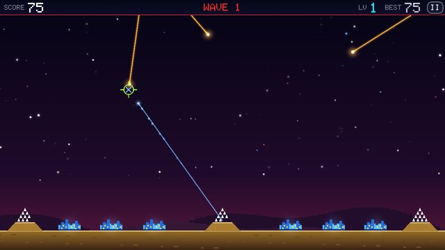<br><sub><b>18 Invasive Action</b><br>Defend six cities from falling warheads with a sky full of fireballs.</sub></td>
<td align="center" valign="top" width="20%">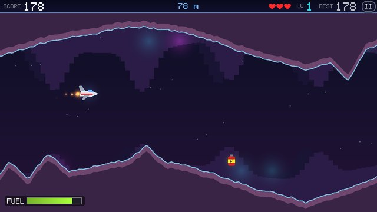<br><sub><b>19 Jet Flight</b><br>Thread a jet through twisting caverns and city towers.</sub></td>
<td align="center" valign="top" width="20%">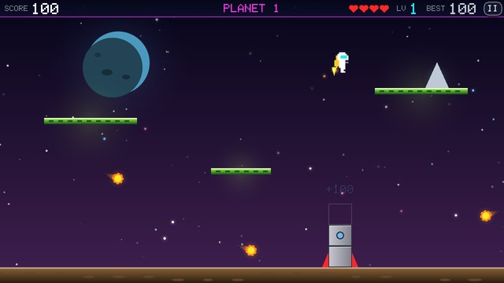<br><sub><b>20 Jet Mobile</b><br>Build your rocket, fuel it up and blast off, jetpack and laser in hand.</sub></td>
</tr>
<tr>
<td align="center" valign="top" width="20%">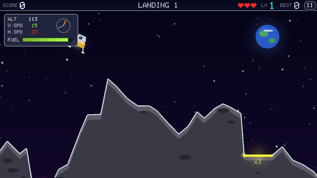<br><sub><b>21 Lunar Landing</b><br>Bring the lander down gently on a lunar pad, with fuel to spare.</sub></td>
<td align="center" valign="top" width="20%">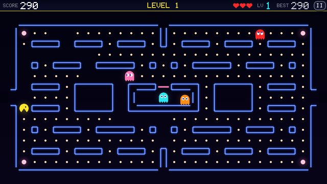<br><sub><b>22 Maze Eater</b><br>Munch every dot in the neon maze while four goblins give chase.</sub></td>
<td align="center" valign="top" width="20%">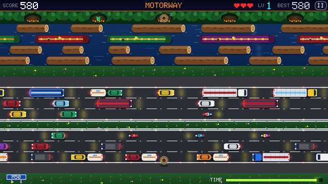<br><sub><b>23 Motorway</b><br>Help a hedgehog across a busy motorway and a river to safety.</sub></td>
<td align="center" valign="top" width="20%">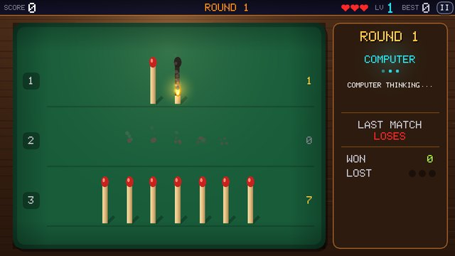<br><sub><b>24 Nim</b><br>Take matches in turn. Whoever takes the last one loses.</sub></td>
<td align="center" valign="top" width="20%">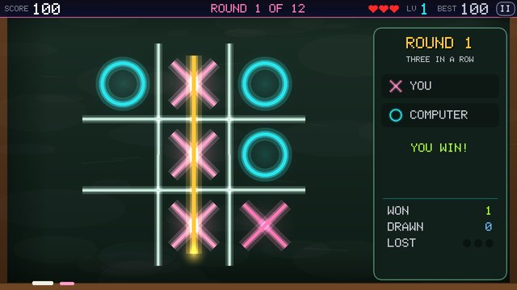<br><sub><b>25 Noughts and Crosses</b><br>Outwit the computer at three, then four, in a row.</sub></td>
</tr>
<tr>
<td align="center" valign="top" width="20%">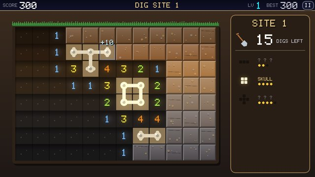<br><sub><b>26 Old Bones</b><br>Dig for dinosaur fossils, using clues in the soil.</sub></td>
<td align="center" valign="top" width="20%">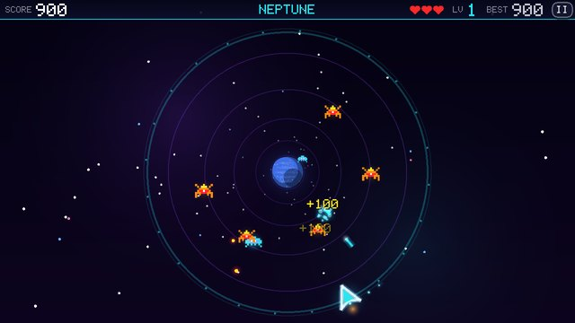<br><sub><b>27 Orbitter</b><br>Circle the rim and blast the aliens spiralling out of the void.</sub></td>
<td align="center" valign="top" width="20%">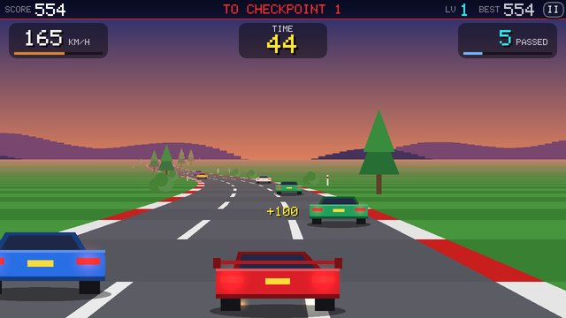<br><sub><b>28 Overtake</b><br>Race the clock and overtake everything on the road.</sub></td>
<td align="center" valign="top" width="20%">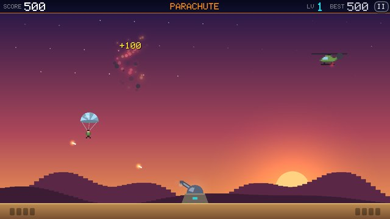<br><sub><b>29 Parachute</b><br>Hold the base: shoot down the paratroopers before they land.</sub></td>
<td align="center" valign="top" width="20%">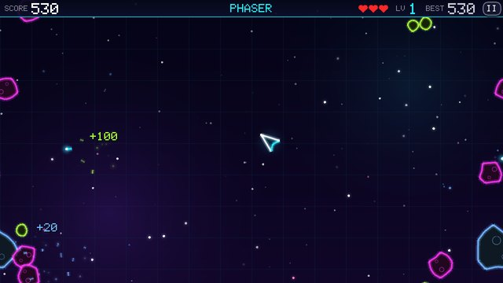<br><sub><b>30 Phaser</b><br>Blast the drifting rocks to dust in a neon vector storm.</sub></td>
</tr>
<tr>
<td align="center" valign="top" width="20%">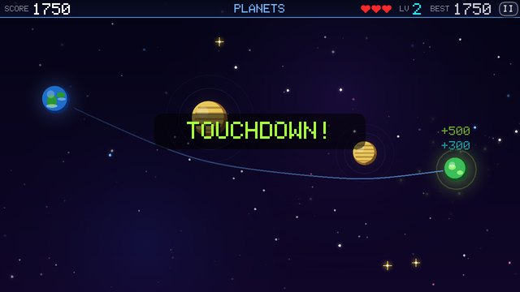<br><sub><b>31 Planets</b><br>Slingshot a space probe round the planets to reach the target world.</sub></td>
<td align="center" valign="top" width="20%">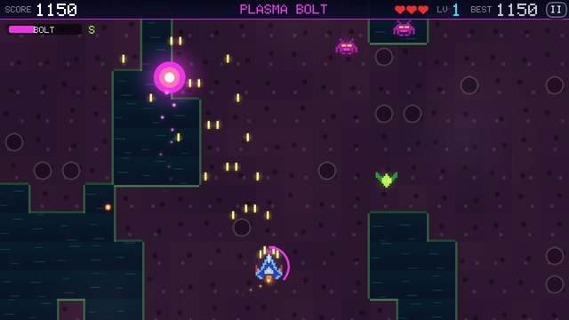<br><sub><b>32 Plasma Bolt</b><br>Charge your plasma cannon and blast through alien waves and motherships.</sub></td>
<td align="center" valign="top" width="20%">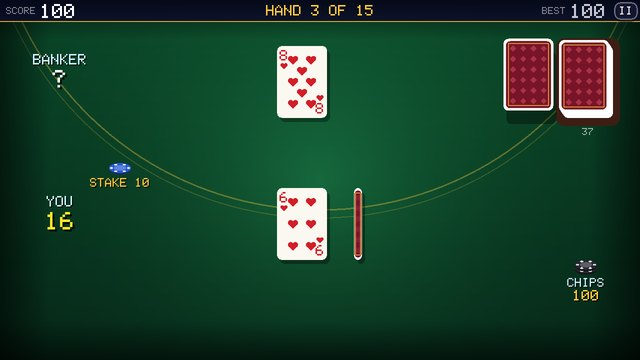<br><sub><b>33 Pontoon</b><br>Buy, twist or stick: beat the banker at the British blackjack.</sub></td>
<td align="center" valign="top" width="20%">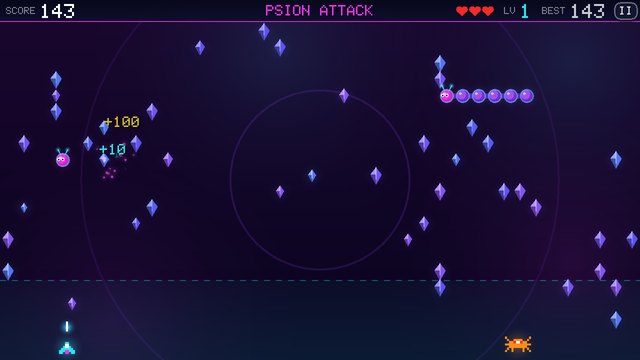<br><sub><b>34 Psion Attack</b><br>Blast the psychic worm before it snakes down through the crystals.</sub></td>
<td align="center" valign="top" width="20%">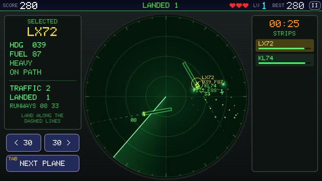<br><sub><b>35 Radar Landing</b><br>Talk the traffic down: steer every flight safely on to the runways.</sub></td>
</tr>
<tr>
<td align="center" valign="top" width="20%">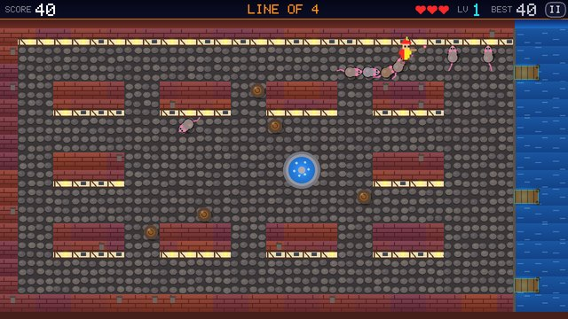<br><sub><b>36 Rats</b><br>Pipe the rats of Hamelin into a conga line and march them into the river.</sub></td>
<td align="center" valign="top" width="20%">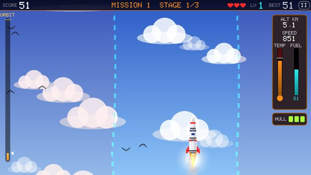<br><sub><b>37 Rocket Launch</b><br>Throttle, steer and stage your rocket all the way to orbit.</sub></td>
<td align="center" valign="top" width="20%">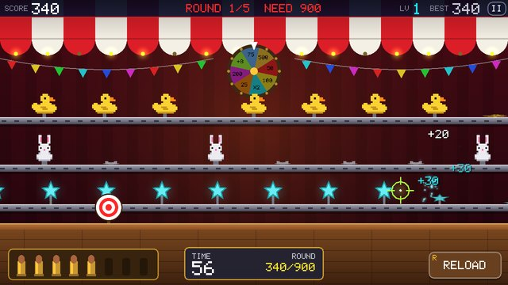<br><sub><b>38 Sitting Target</b><br>Roll up! Knock down the tin ducks at the fairground shooting gallery.</sub></td>
<td align="center" valign="top" width="20%">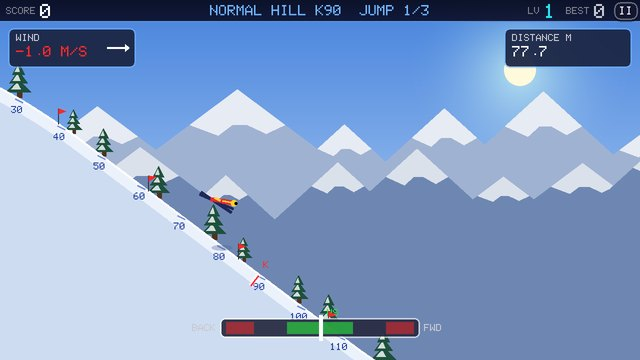<br><sub><b>39 Ski Jump</b><br>Fly for distance and style on three ever bigger ski jumps.</sub></td>
<td align="center" valign="top" width="20%">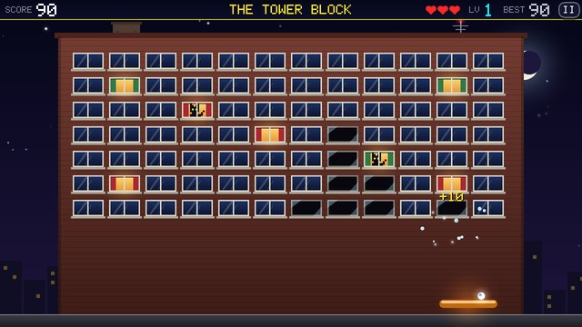<br><sub><b>40 Smash the Windows</b><br>Bounce a ball through every window of the old tower block.</sub></td>
</tr>
<tr>
<td align="center" valign="top" width="20%">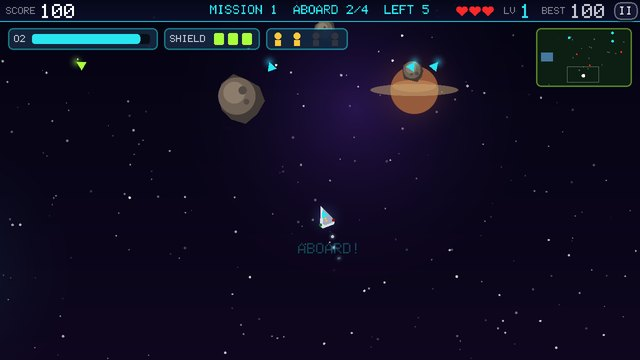<br><sub><b>41 Space Mission</b><br>Rescue the stranded astronauts before their oxygen runs out.</sub></td>
<td align="center" valign="top" width="20%">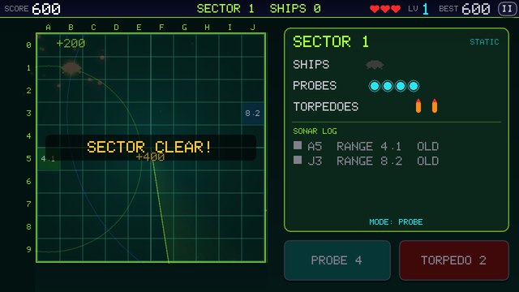<br><sub><b>42 Space Search</b><br>Triangulate the cloaked alien mothership, then fire a torpedo.</sub></td>
<td align="center" valign="top" width="20%">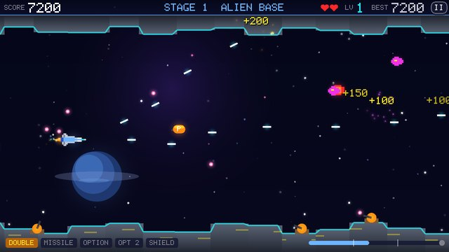<br><sub><b>43 Space Ship</b><br>Blast through asteroids, alien bases and tunnels to the boss.</sub></td>
<td align="center" valign="top" width="20%">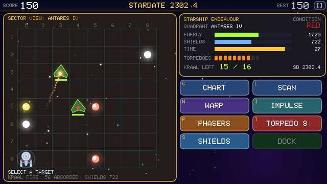<br><sub><b>44 Star Trek</b><br>Command the starship Endeavour and clear the galaxy of Kraal warships.</sub></td>
<td align="center" valign="top" width="20%">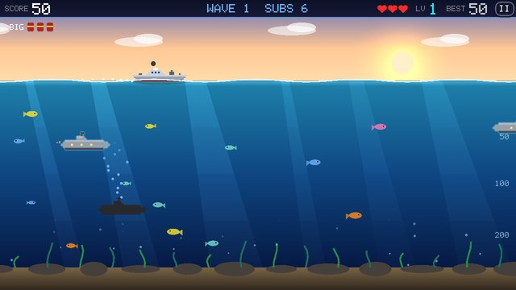<br><sub><b>45 Submarines</b><br>Hunt the submarines below with depth charges, and dodge their torpedoes.</sub></td>
</tr>
<tr>
<td align="center" valign="top" width="20%">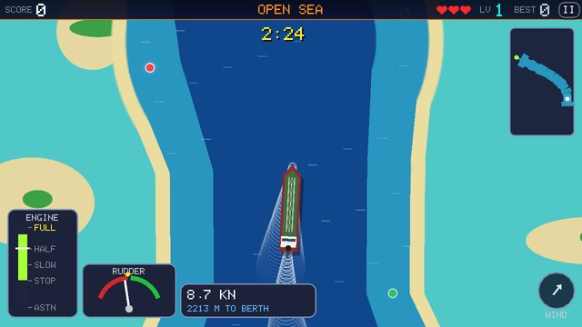<br><sub><b>46 Tanker</b><br>Steer a mighty oil tanker into port. It turns like a continent.</sub></td>
<td align="center" valign="top" width="20%">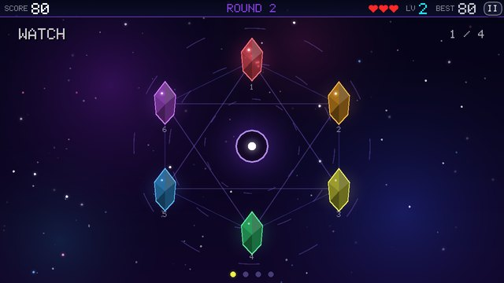<br><sub><b>47 The Force</b><br>Six singing crystals. One growing sequence. How strong is your mind?</sub></td>
<td align="center" valign="top" width="20%">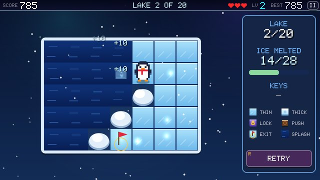<br><sub><b>48 Thin Ice</b><br>Melt every tile of ice behind you, then skate to the exit.</sub></td>
<td align="center" valign="top" width="20%">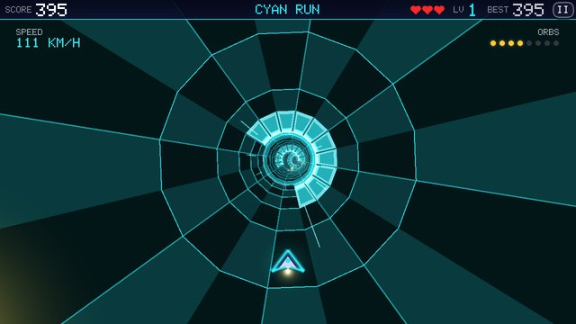<br><sub><b>49 Tunnel Escape</b><br>Spin through a twisting neon tunnel at ever-rising speed.</sub></td>
<td align="center" valign="top" width="20%">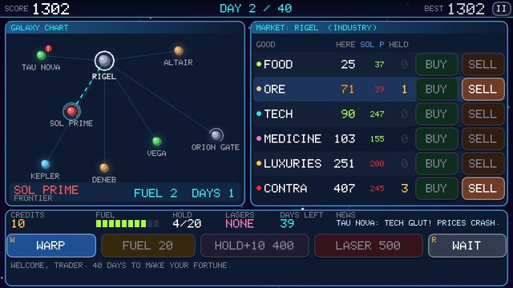<br><sub><b>50 Universe</b><br>Trade across the stars. Forty days to make your fortune.</sub></td>
</tr>
</table>

## How it's built

- **No content pipeline.** Everything is generated at start-up: one atlas texture (a white texel, an anti-aliased disc,
  a glow, and the Oric ROM font magnified 8x), every sound effect and the menu music (`Audio/Synth.cs`, `Audio/Music.cs`).
- **Resolution independent.** Games draw on a 640x360 virtual playfield with vector shapes (`Graphics/Gfx.cs`), batched
  through one `BasicEffect`. Extra screen width or height becomes margin: phones put the touch controls in the side
  margins, tablets get a control strip under the playfield.
- **One file per game** in `Cascade50.Core/Games/All/`, each a `MiniGame` (see [docs/GAME_GUIDE.md](docs/GAME_GUIDE.md)).
  The framework provides the menu, info pages, score bar, pause, game over, best scores and touch controls.

| Project | Target |
|---|---|
| `Cascade50.Core` | The whole app (net10.0): framework, scenes, the fifty games, store capture |
| `Cascade50.Android` | Android 6+ |
| `Cascade50.iOS` | iOS 15+ (UIScene life cycle) |
| `Cascade50.DesktopGL` | macOS (also runs on Linux and Windows) |
| `Cascade50.WindowsDX` | Windows (DirectX), packaged as MSIX for the Microsoft Store |
| `Cascade50.Tests` | xUnit soak tests: every game auto-played and button-mashed for minutes, on both input schemes |

Bundle ID (iOS and macOS) and Android package name: `uk.co.allthejohnsons.cascade50`.

## Controls

| | Desktop | Phone / tablet |
|---|---|---|
| Move | Cursor keys or WASD (or a game pad) | On-screen stick |
| Fire / action | `SPACE`, `Z` or `Enter` (pad A) | FIRE button |
| Second action | `X`, `Shift` or right click (pad B) | ALT button |
| Pointer games | Mouse | Tap and drag the playfield |
| Pause | `P` / `Esc` (pad Start) | The pause button, or Back on Android |
| Full screen | `F11` or `Alt`+`Enter` | Always |

## Build and run

```sh
dotnet test Cascade50.Tests                    # soak tests
dotnet run --project Cascade50.DesktopGL       # play on the Mac
```

Release builds go to `release/` (git-ignored):

```sh
tools/build_release.sh       # Android .aab/.apk (key ~/keys/cascade50-upload.jks, password in the Keychain) and iOS .ipa
tools/build_desktop.sh       # macOS universal .app + App Store .pkg   (tools/build_desktop.sh dev: locally runnable)
tools/build_windows.sh       # Windows x64 + arm64 .msix/.zip, built and tested in the Parallels "Windows 11" VM
```

Signing identities and the Microsoft Store identity are read from `signing.local.props`, which is not in the
repository: copy `signing.local.props.example` and fill in your own. Provisioning profiles (`devel-cascade50`,
`rel-cascade50`, `devel-cascade50-mac`, `rel-cascade50-macos`) and the Android upload key are read from `~/Downloads`,
`~/keys` and the Keychain, and are never committed.

## Store assets

The store material (listing copy, privacy policy, support page, screenshots, previews and art) is generated into
`stores/`, which is not in the repository. To regenerate it:

```sh
dotnet run --project Cascade50.DesktopGL -- --art art/rendered    # icon, splash and store art, drawn by the game
python3 tools/make_icons.py                                      # every platform icon and launch image
tools/capture_store.sh                                           # screenshots at every store size + app previews
CASCADE50_SUPPORT_EMAIL=you@example.com python3 tools/make_support_page.py   # stores/Cascade50-Support.html
python3 tools/check_listing.py                                   # character limits
```

## Licence

The Cascade 50 code, tools and documentation are released under the **[DILLIGAF License](LICENSE)**. It can't cover
what isn't ours: the original *Cassette 50* and its game names, the Oric ROM font, and third-party packages such as
MonoGame, which keep their own licences.
